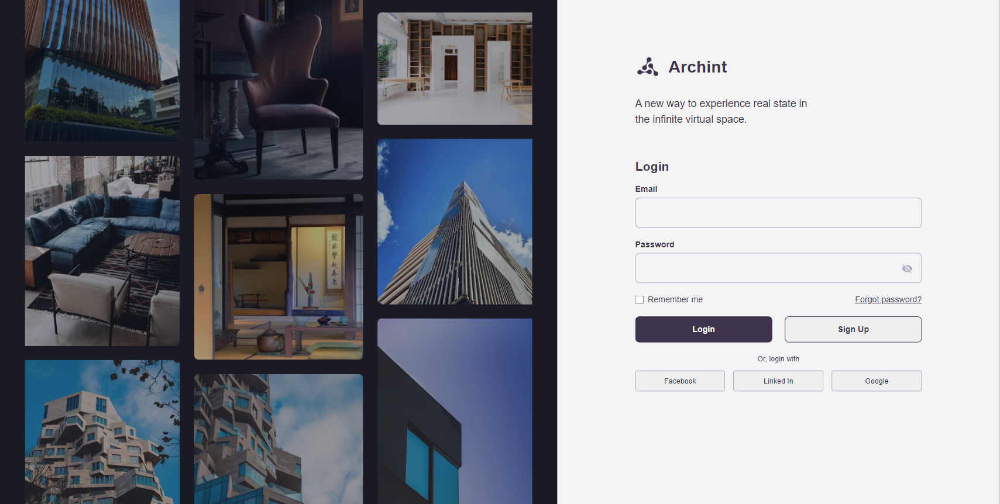

## 💻 Desafio - Archint
Esse projeto foi um desafio de recriar uma aplicação, a partir de um layout pronto no Figma.

  

[Clique aqui para acessar](https://archint-three.vercel.app/)
 
 

## 👨‍💻 Como baixar e rodar

Faça o download do projeto, clicando no botão verde "< > Code" depois em "Download ZIP".  
Após isso extraia o arquivo onde desejar e utilizando o "Vs code" abra a pasta na onde se encontra o projeto. Em seguida abra o terminal do "Vs code" e digite:

> npm i

Este comando irá fazer o download da pasta node_modules,
depois que o download for concluído utilize este comando para iniciar o projeto:

> npm run dev

o terminal irá te dar um link onde você poderá acessar o projeto.

---

## 🚀 Tecnologias

Esse projeto foi desenvolvido com as seguintes tecnologias:

- HTML
- CSS
- React
- Vite
- Javascript
- Git e Github
---
## 💻 Contato
pedro.kleinfelder@hotmail.com
